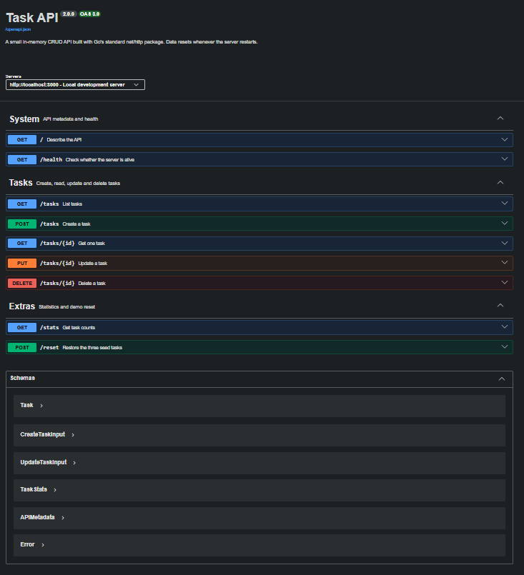

# Tiny Go Task API

A complete in-memory CRUD API for managing to-do tasks, built with Go's standard `net/http` package. This expands the original two-endpoint server into a documented and tested backend with validation, filtering, pagination, statistics and Swagger UI.

## Features

- Full CRUD: create, list, read, update and delete tasks
- Correct HTTP status codes: `200`, `201`, `204`, `400` and `404`
- Strict JSON validation with useful error messages
- Filtering by completion state and case-insensitive title search
- Offset pagination with result-count headers
- Statistics and seed-data reset endpoints
- Concurrency-safe in-memory storage
- OpenAPI 3.0 specification and interactive Swagger UI
- Integration tests, race detection and GitHub Actions CI
- Zero Go dependencies outside the standard library

## Requirements

- Go 1.22 or newer
- `curl` for the command-line examples
- Internet access in the browser for the pinned Swagger UI assets; the API and `/openapi.json` work offline

## Run locally

```bash
go run .
```

The server starts at `http://localhost:3000`. Override the port when needed:

```bash
PORT=8080 go run .
```

Open:

- API metadata: `http://localhost:3000/`
- Health check: `http://localhost:3000/health`
- Swagger UI: `http://localhost:3000/docs`
- OpenAPI JSON: `http://localhost:3000/openapi.json`

## Endpoint reference

| Method   | Path            | Purpose                                 | Success |
| -------- | --------------- | --------------------------------------- | ------- |
| `GET`    | `/`             | Describe the API                        | `200`   |
| `GET`    | `/health`       | Check server health                     | `200`   |
| `GET`    | `/tasks`        | List, filter, search and paginate tasks | `200`   |
| `GET`    | `/tasks/{id}`   | Read one task                           | `200`   |
| `POST`   | `/tasks`        | Create a task                           | `201`   |
| `PUT`    | `/tasks/{id}`   | Update title and/or completion state    | `200`   |
| `DELETE` | `/tasks/{id}`   | Delete a task                           | `204`   |
| `GET`    | `/stats`        | Count total, done and open tasks        | `200`   |
| `POST`   | `/reset`        | Restore the three seed tasks            | `200`   |
| `GET`    | `/docs`         | Open Swagger UI                         | `200`   |
| `GET`    | `/openapi.json` | Read the OpenAPI contract               | `200`   |

### List query parameters

```text
GET /tasks?done=false&search=api&limit=10&offset=0
```

| Parameter | Meaning                       | Rules                   |
| --------- | ----------------------------- | ----------------------- |
| `done`    | Filter by completion state    | `true` or `false`       |
| `search`  | Case-insensitive title search | any text                |
| `limit`   | Maximum returned tasks        | `1`–`100`, default `50` |
| `offset`  | Number of matches to skip     | `0` or greater          |

The list response includes `X-Total-Count`, `X-Limit` and `X-Offset` headers.

## Full CRUD example

Create:

```bash
curl -i -X POST http://localhost:3000/tasks \
  -H "Content-Type: application/json" \
  -d '{"title":"Buy milk"}'
```

Expected response:

```http
HTTP/1.1 201 Created
Content-Type: application/json; charset=utf-8
Location: /tasks/4

{"id":4,"title":"Buy milk","done":false}
```

Update:

```bash
curl -i -X PUT http://localhost:3000/tasks/4 \
  -H "Content-Type: application/json" \
  -d '{"title":"Buy oat milk","done":true}'
```

Delete:

```bash
curl -i -X DELETE http://localhost:3000/tasks/4
```

Run the entire demonstration automatically:

```bash
./scripts/demo.sh
```

## Validation examples

An empty or missing title returns `400 Bad Request`:

```json
{ "error": "title is required and cannot be empty" }
```

An unknown task returns `404 Not Found`:

```json
{ "error": "Task 99 not found" }
```

A successful delete returns `204 No Content` with an empty body.

## Test and quality checks

```bash
make check
```

This verifies formatting, runs `go vet`, executes the integration tests and enables Go's race detector.

Individual commands:

```bash
make fmt
make vet
make test
```

## Run with Docker

```bash
docker build -t tiny-go-task-api .
docker run --rm -p 3000:3000 tiny-go-task-api
```

## Swagger UI

After starting the server, open `http://localhost:3000/docs` and use **Try it out** to complete a create → read → update → delete cycle.



## Why data disappears after restart

The repository intentionally stores tasks in memory rather than in a database. When the process stops, its Go slice disappears; the next run starts again from the three seed tasks. This is expected for the Week 2 assignment and demonstrates why persistent databases are needed.

## Project structure

```text
.
├── api/openapi.json       # API contract
├── web/docs.html          # Swagger UI host page
├── scripts/demo.sh        # Complete curl verification flow
├── app.go                 # Routes, handlers, validation and middleware
├── store.go               # Concurrency-safe in-memory repository
├── models.go              # Request and response types
├── app_test.go            # HTTP integration tests
├── main.go                # Server startup
├── Dockerfile
├── Makefile
└── notes.md
```
